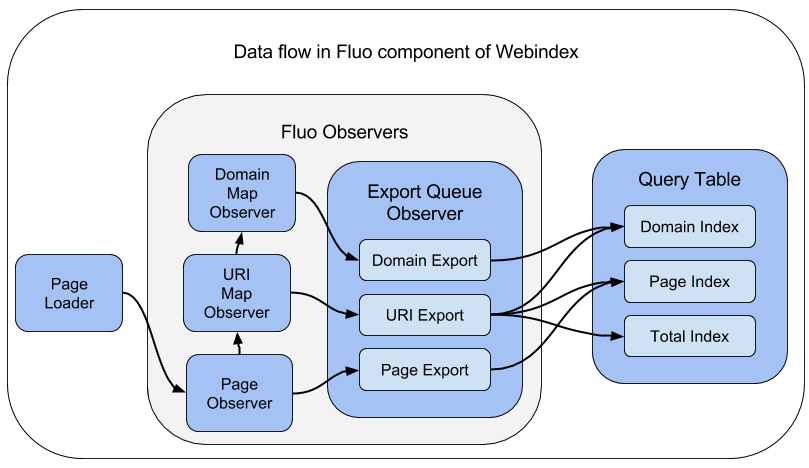

# Code Guide

The Webindex example has three major code components.

 * Spark component :  Generates initial Fluo and Query tables.
 * Fluo component :  Updates the Query table as web pages are added, removed, and updated.
 * Web component : Web application that uses the Query table. 

## Guide to Fluo Component.

The following image shows a high level view of how data flows through the Fluo Webindex code.   

<!--
The image was produced using Google Docs.  A link to the source is here.
https://docs.google.com/drawings/d/1vl26uXtScXn1ssj3WEb-qskuH-15OOmWul1B562oWDc/edit?usp=sharing
-->

### Page Loader
### Page Observer

This observer computes the changes to links within a page.  It computes the
links added and deleted and then push this information to the URI Map Observer
and Page Exporter.

**Code:** [PageObserver.java][PageObserver]

### URI Map Observer

The code this this observer is very simple because it builds on the Collision
Free Map Recipe.  The observer responds to an update in the number of URIs that
refererence a URI.  It pushes these changes in reference counts to the Domain
Map and URI Exporter.

**Code:** [UriMap.java][UriMap]

### Domain Map Observer
### Page Exporter
### URI Exporter
### Domain Exporter

[PageObserver]: ../modules/data/src/main/java/io/fluo/webindex/data/fluo/PageObserver.java
[UriMap]: ../modules/data/src/main/java/io/fluo/webindex/data/fluo/UriMap.java

